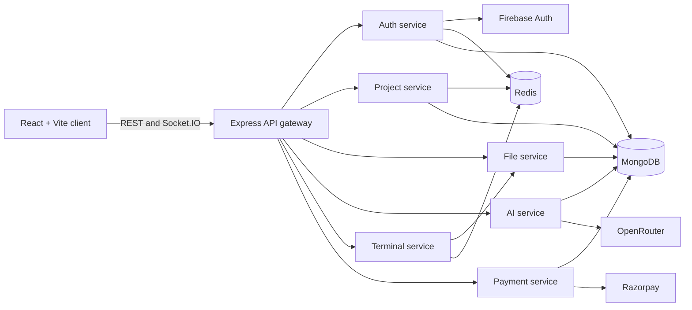

# Vertex AI

Vertex AI is a browser-based AI development environment for creating projects, editing files, previewing applications, and working with an AI coding assistant from one workspace.

The application is organized as a TypeScript monorepo with a React/Vite client, an Express gateway, and focused backend services for authentication, projects, files, AI, terminal sessions, and payments.

## Features

- Firebase Google authentication
- Project creation, listing, starring, and deletion
- Hierarchical file and folder management
- In-browser code editing with Monaco Editor
- HTML, CSS, JavaScript, and React preview workflows
- AI-assisted code generation and project interaction
- Streaming terminal sessions over Socket.IO
- Usage credits and subscription plans
- Razorpay checkout and payment verification
- Redis-backed sessions and caching
- MongoDB-backed application data
- Responsive dashboard and project workspace

## Architecture



### Repository layout

```text
.
├── client/                         React, TypeScript, and Vite frontend
│   ├── src/components/             Dashboard, editor, preview, AI, terminal UI
│   ├── src/context/                Auth, project, and file state
│   ├── src/pages/                  Dashboard, project workspace, plans
│   └── src/services/               AI client and streaming helpers
└── server/
    ├── gateway/                    Public API gateway and Socket.IO entrypoint
    ├── services/
    │   ├── ai/                     AI chat and code-generation workflows
    │   ├── auth/                   Firebase auth and session management
    │   ├── file/                   File and folder persistence
    │   ├── payment/                Razorpay orders and verification
    │   ├── project/                Project persistence and starred projects
    │   └── terminal/               Interactive terminal sessions
    ├── shared/redis/               Shared Redis client
    └── docker-compose.yml           Optional local Redis helper
```

## Technology Stack

### Client

- React 19
- TypeScript
- Vite
- Tailwind CSS
- React Router
- Monaco Editor
- Xterm.js and Socket.IO client
- Firebase Web SDK
- React Markdown and syntax highlighting

### Server

- Node.js
- TypeScript with native ESM
- Express 5
- MongoDB with Mongoose
- Redis with ioredis
- Socket.IO
- Firebase Admin SDK
- LangChain and LangGraph
- OpenRouter
- Razorpay

## Local Development

### Prerequisites

Install the following before starting the project:

- Node.js 22 or newer
- npm
- A MongoDB database, such as MongoDB Atlas
- A Firebase project with Google sign-in enabled
- Redis running locally or a Redis-compatible managed instance
- An OpenRouter API key for AI features
- Razorpay test credentials for payment testing

### Install dependencies

The repository is not configured as a single npm workspace. Install dependencies in each application package.

```powershell
cd client
npm ci

cd ..\server
npm ci

cd gateway
npm ci

cd ..\services\auth
npm ci

cd ..\project
npm ci

cd ..\file
npm ci

cd ..\ai
npm ci

cd ..\terminal
npm ci

cd ..\payment
npm ci
```

The service packages can also be installed from the `server` directory with `npm ci --prefix <package-directory>`.

### Start Redis locally

The included Compose file only starts Redis and does not run the application services.

```powershell
cd server
npm run docker:up
```

To stop it:

```powershell
npm run docker:down
```

Docker is optional for production deployment. Render is currently configured with native Node services and a managed Redis instance.

### Environment files

Copy each example file to `.env` in the same directory and fill in real values locally:

| Package | Example file |
|---|---|
| Gateway | `server/gateway/.env.example` |
| Auth | `server/services/auth/.env.example` |
| Project | `server/services/project/.env.example` |
| File | `server/services/file/.env.example` |
| AI | `server/services/ai/.env.example` |
| Terminal | `server/services/terminal/.env.example` |
| Payment | `server/services/payment/.env.example` |

Never commit `.env` files, private keys, database passwords, or payment secrets. The repository `.gitignore` excludes local environment files while keeping the example files available.

### Client variables

Create `client/.env` with:

```dotenv
VITE_SERVER_URL=http://localhost:8000
VITE_FIREBASE_API_KEY=
VITE_FIREBASE_AUTH_DOMAIN=
VITE_FIREBASE_PROJECT_ID=
VITE_FIREBASE_STORAGE_BUCKET=
VITE_FIREBASE_MESSAGING_SENDER_ID=
VITE_FIREBASE_APP_ID=
```

Vite exposes `VITE_*` values to the browser bundle. Only place public Firebase web configuration in the client environment. Never place Firebase Admin credentials, MongoDB credentials, Redis credentials, OpenRouter keys, or Razorpay secrets in `client/.env`.

### Run the client

```powershell
cd client
npm run dev
```

The Vite development server runs at `http://localhost:3000` in this repository.

### Run backend services

Run each service in its own terminal after its environment file is configured:

```powershell
cd server\gateway
npm run dev
```

```powershell
cd server\services\auth
npm run dev
```

Use the same pattern for `project`, `file`, `ai`, `terminal`, and `payment`.

The default local ports are:

| Service | Port | Local URL |
|---|---:|---|
| Gateway | 8000 | `http://localhost:8000` |
| Auth | 8001 | `http://localhost:8001` |
| Project | 8002 | `http://localhost:8002` |
| File | 8003 | `http://localhost:8003` |
| AI | 8004 | `http://localhost:8004` |
| Terminal | 8005 | `http://localhost:8005` |
| Payment | 8006 | `http://localhost:8006` |
| Redis | 6379 | `redis://localhost:6379` |

For local development, service URLs should use full URLs such as `http://localhost:8001`. The gateway also accepts host-and-port values in deployments and adds the HTTP protocol when necessary.

## Build and Quality Checks

Build the client:

```powershell
cd client
npm run build
```

Run the client linter:

```powershell
cd client
npm run lint
```

Build a backend package:

```powershell
cd server\services\auth
npm run build
```

The gateway and each backend service have the same `build` script. A successful TypeScript build is required before starting the compiled service.

## API Surface

The browser talks to the gateway rather than calling private services directly. Gateway routes are mounted under `/api`.

| Gateway route | Responsibility |
|---|---|
| `POST /api/auth/login` | Create an authenticated session from a Firebase token |
| `POST /api/auth/logout` | End the current session |
| `GET /api/user/me` | Return the current user |
| `/api/projects` | Create, list, star, retrieve, and delete projects |
| `/api/files` | Create, update, retrieve, and delete files and folders |
| `POST /api/ai/chat` | Run an authenticated AI chat request |
| `/api/terminal` | Proxy terminal-related HTTP traffic |
| Socket.IO `/terminal` | Establish interactive terminal sessions |
| `/api/payment/orders` | Create a Razorpay order |
| `/api/payment/verify` | Verify a completed payment |

The gateway root endpoint returns a health response:

```text
GET /
```

The terminal service exposes:

```text
GET /health
```

Protected routes use the HTTP-only `session` cookie. In production, the auth service sets the cookie with `SameSite=None` and `Secure=true` so the deployed client and gateway can communicate across their Render origins. In local development it uses `SameSite=Lax`.

## Render Deployment

The production deployment uses Render without Docker:

- One static site for `client`
- One public Node web service for `server/gateway`
- Six private Node services under `server/services`
- One managed Render Key Value instance for Redis

For every backend service, use `server` as the Render root directory. Render must install development dependencies because TypeScript and the declaration packages are required during the build.

### Gateway

```text
Root directory: server
Build command: npm ci --include=dev && npm ci --include=dev --prefix gateway && npm run build --prefix gateway
Start command: node gateway/dist/server/gateway/src/server.js
Health check: /
```

### Private services

Use the following native Node configuration:

| Service | Build command suffix | Start command |
|---|---|---|
| Auth | `--prefix services/auth` | `node services/auth/dist/services/auth/src/server.js` |
| Project | `--prefix services/project` | `node services/project/dist/services/project/src/server.js` |
| File | `--prefix services/file` | `node services/file/dist/services/file/src/server.js` |
| AI | `--prefix services/ai` | `node services/ai/dist/services/ai/src/server.js` |
| Terminal | `--prefix services/terminal` | `node services/terminal/dist/services/terminal/src/server.js` |
| Payment | `--prefix services/payment` | `node services/payment/dist/services/payment/src/server.js` |

For example, the Auth build command is:

```text
npm ci --include=dev && npm ci --include=dev --prefix services/auth && npm run build --prefix services/auth
```

Set `NODE_ENV=production` and `HOST=0.0.0.0` on every backend service. Render supplies `PORT` automatically for public web services; private services can use their configured service ports from the example environments.

### Service connections

Use Render private-network hostnames or internal addresses for backend-to-backend communication. The gateway needs values for:

```dotenv
AUTH_SERVICE_URL=http://<auth-private-host>:8001
PROJECT_SERVICE_URL=http://<project-private-host>:8002
FILE_SERVICE_URL=http://<file-private-host>:8003
AI_SERVICE_URL=http://<ai-private-host>:8004
TERMINAL_SERVICE_URL=http://<terminal-private-host>:8005
PAYMENT_SERVICE_URL=http://<payment-private-host>:8006
```

Use the managed Redis connection string for `REDIS_URL`. Keep MongoDB, Firebase Admin, OpenRouter, and Razorpay secrets in Render's encrypted environment settings.

### Client and cross-origin settings

Set the client build variable:

```dotenv
VITE_SERVER_URL=https://<gateway-service>.onrender.com
```

Set the gateway variable to the exact client origin without a trailing slash:

```dotenv
CORS_ORIGIN=https://<client-service>.onrender.com
```

Set the AI service's frontend URL to the same client origin:

```dotenv
FRONTEND_URL=https://<client-service>.onrender.com
```

After changing these values, redeploy the affected services. If login succeeds but protected requests return `401`, sign in again after the auth service has been redeployed so the browser receives a fresh production cookie.

## Security Notes

- Rotate any credential that has been exposed in a terminal, screenshot, commit, issue, or chat.
- Keep `.env` files out of GitHub.
- Use separate MongoDB, Firebase, OpenRouter, and Razorpay credentials for development and production.
- Use Razorpay test mode until payment verification has been tested end to end.
- Restrict MongoDB network access to the required deployment sources.
- Configure Firebase authorized domains for the deployed client origin.
- Use HTTPS URLs for all production browser and service connections.
- Do not put server-side secrets in `VITE_*` variables.
- Review Redis persistence and retention requirements before treating sessions as production-critical data.

## Future AWS Deployment

The service boundaries are suitable for a later AWS migration. A typical target architecture would be:

- S3 and CloudFront for the Vite static client
- ECS/Fargate or App Runner for the gateway and private services
- ElastiCache for Redis
- MongoDB Atlas or Amazon DocumentDB, depending on compatibility requirements
- Secrets Manager or Systems Manager Parameter Store for credentials
- Application Load Balancer or API Gateway for the public gateway
- CloudWatch for logs, metrics, and alarms

The current Render deployment is the reference production topology. An AWS migration should preserve the gateway contract, private service URLs, cookie policy, WebSocket support, and secret boundaries before changing infrastructure.

## Contributing

1. Create a feature branch.
2. Keep secrets and local environment files out of commits.
3. Install dependencies only in the package you are changing when possible.
4. Run the relevant TypeScript build and client lint command.
5. Test authenticated requests, cookies, and Socket.IO behavior when touching gateway or auth code.
6. Open a pull request with the behavior change, deployment impact, and required environment variables documented.

## License

No license file has been added to this repository yet. Add a license before distributing the project publicly or accepting external contributions.
